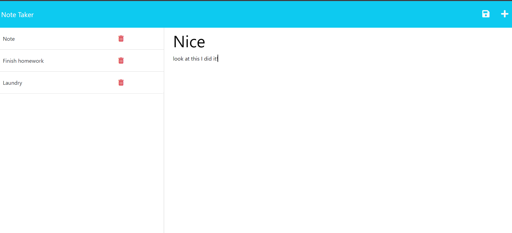

# Note Taker with Express.JS
  

            
## Table of Contents:
1. [Description](#description)
2. [Installation](#installation)
3. [Usage](#usage)
4. [Contributing](#contributing)
5. [Tests](#tests)
6. [Questions](#questions)
7. [License](#license)

## Description:
This is a project designed to help you be able to take notes down so that you dont forget to do anything in the day!          

## Installation:
To install this appicaltion, gitclone the repo onto your local machine. Once you have the repo cloned into the machine open it up inside of a terminal. Typer npm i into the terminal and hit enter. This will get you the dependancies you need to run the project. After that you can just type node index.js and hit enter and this will run  the program for you.
            
## Usage:
You use this application to take notes throughout your day.
            
## Contributing:
This was a solo project.
            
## Tests:
N/A
    
## Questions:
Email: tylerbedard126@gmail.com

GitHub: 
[tbedard126](https://github.com/tbedard126)

Link to deployed site:
[NoteTaker](https://ancient-journey-06603.herokuapp.com/)

Email is the best way to contact me.
## License:

  MIT
  
  
  